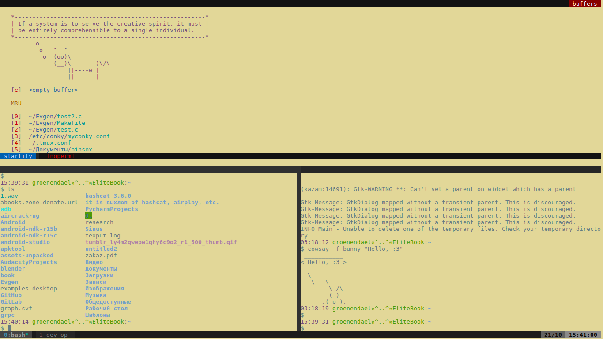
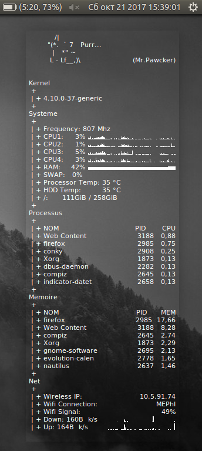
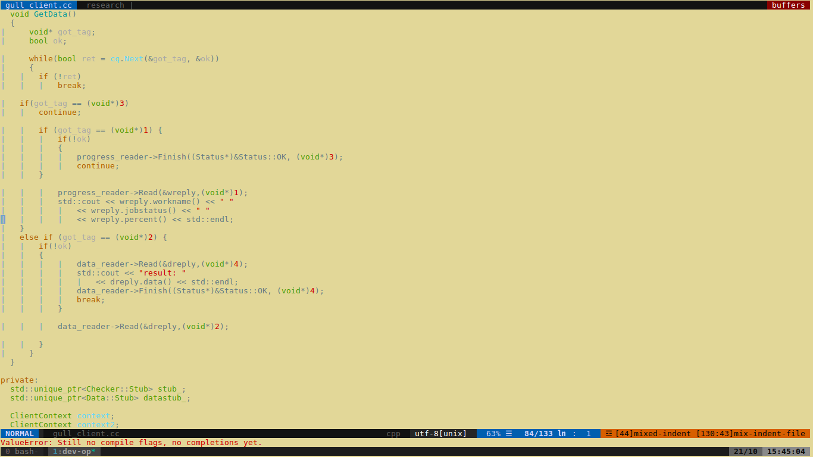
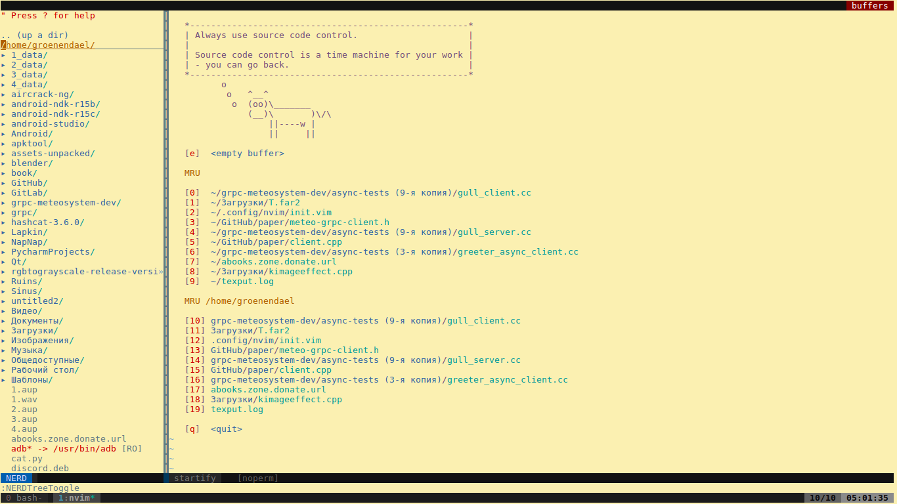

# configs

## WhatIsIt

Bunch of config-like files for:

### tmux

(style and usability)

### conky

(aestetic and useful)

### neovim

(plugins, bindings, other lil tricks)

## WhatToDo

Install'em and, maybe, it will work nicely
